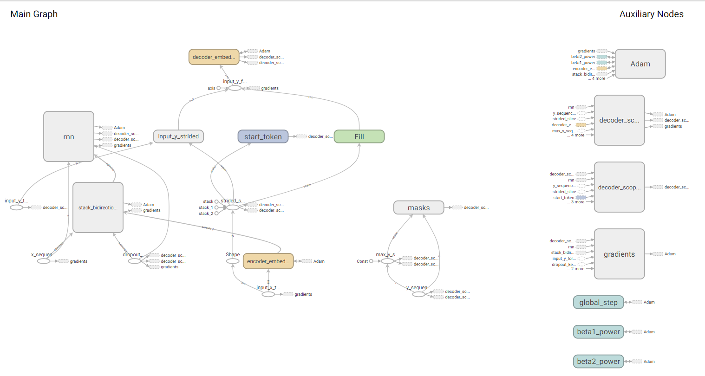

# simple_seq2seq
A simple example of seq2seq model.

## Requirement
- python3
- tensorflow 1.6.0
- numpy

## Model structure


The model struture refers to the paper: [2016_Wu et al. Google's neural machine translation system: Bridging the gap between human and machine translation](https://arxiv.org/pdf/1609.08144.pdf%20\(7.pdf)

**[ input sequence ] -> [ embedding ] -> [ encoder layers: bidirection rnn + single-direction rnn ] -> [ attention mechanism ] -> [ decoder rnn layers ] -> [ softmax (fully-connected layer) -> [ output sequence ] ]**

The model graph in tensorboard is shown as following:



## Strat training
```sh
python train.py
```

## Visualizing results in tensorboard
```sh
tensorboard --logdir /"PATH_OF_CODE"/log/"TIMESTAMP"/summaries/
```

## *refernces*
[1]. [2016_Wu et al. Google's neural machine translation system: Bridging the gap between human and machine translation](https://arxiv.org/pdf/1609.08144.pdf%20\(7.pdf)

[2]. [Deep learning for NLP best practices](http://ruder.io/deep-learning-nlp-best-practices/index.html#fnref:20)

[3]. [tensorflow API docs](https://www.tensorflow.org/api_docs/python/tf)
